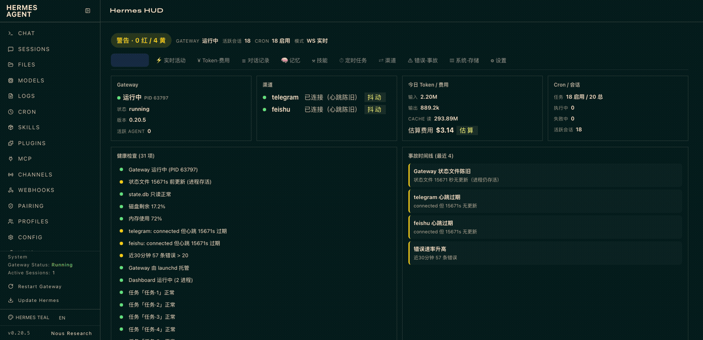
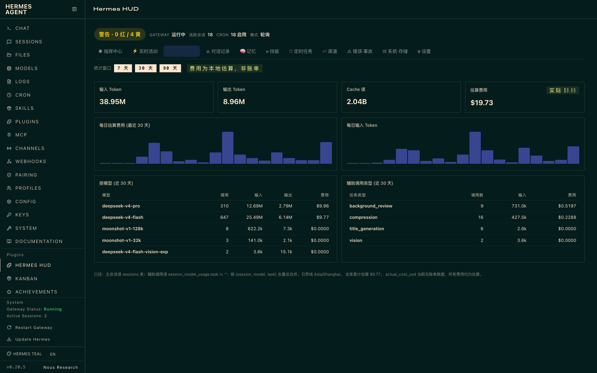
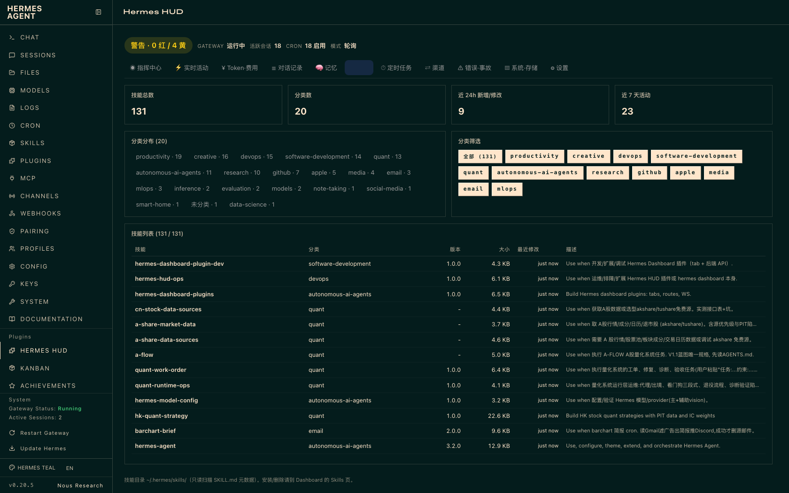

**中文** | [English](README.en.md)

# Hermes HUD 🛰️

> 本地实时监控指挥中心 —— 把 Hermes Agent 的运行状态、Token/费用、模型、记忆、会话、定时任务、渠道、错误和机器健康完整摊开，异常发生时立即看见。

一个**用户级 Hermes Dashboard 插件**：不修改 `~/.hermes/hermes-agent` 核心代码，Hermes 升级不覆盖，可一键禁用/回滚。

    

## ✨ 核心亮点

- 🖥 **11 个中文 Tab 一屏指挥**：健康总览、实时活动、Token/费用、对话、记忆、技能、定时任务、渠道、错误事故、系统存储、设置
- ⚡ **2 秒级实时**：共享快照缓存 + WebSocket 增量事件流，REST 与 WS 不重复采集
- 🔒 **严格只读边界**：Hermes 核心数据全程只读（`mode=ro` + 不锁 Gateway）；日志/路径先脱敏、指纹在脱敏后生成，raw secret 零出口
- 📊 **费用口径可信**：主/辅调用不重复计数、`api_call_count` 累计、估算/实际/未计价三类分开标注
- 🚨 **主动告警**：可选 `hud_alert.py` 把新事故/升级/恢复实时推到 Telegram + 飞书（带防抖与恢复确认状态机）

## 🚀 Quick Start

```bash
git clone https://github.com/Diabloluo/hermes-hud ~/.hermes/plugins/hermes-hud
python3 ~/.hermes/plugins/hermes-hud/scripts/enable_dashboard_plugin.py enable
hermes dashboard --host 127.0.0.1 --port 9119 --no-open
# 打开 http://127.0.0.1:9119 → 侧边栏 "Hermes HUD"
```

> 仓库自带预构建前端，无需重新构建 Hermes Web UI。
> 完整安装/卸载/故障排查见 **[📦 INSTALL.md](INSTALL.md)**；首次上手见 **[⏱ FIRST_5_MINUTES.md](FIRST_5_MINUTES.md)**。

## 🎬 演示（19.5 秒 · 脱敏演示数据）



## 📸 界面预览

**Token·费用页**（按模型/辅助任务归集，费用明确标注估算口径）：



**技能页**（技能目录统计与分类筛选）：



## ✨ 功能

| Tab | 内容 |
|---|---|
| ◉ 指挥中心 | 健康分（正常/警告/故障）、Gateway/渠道/Cron 状态、今日 Token/费用、30 项健康检查、事故时间线、系统迷你卡 |
| ⚡ 实时活动 | 活跃会话、2 秒增量事件流（WebSocket + 轮询兜底）、最近工具调用 |
| ¥ Token·费用 | 7/30/90 天趋势、按模型/辅助任务归集、费用明确标注"估算/实际/未计价" |
| ☰ 对话记录 | 搜索、分页、会话详情（消息预览 + model usage） |
| 🧠 记忆 | MEMORY.md/USER.md 元数据、锁文件健康 |
| ⚒ 技能 | 技能目录统计、分类筛选与本机技能列表 |
| ⏱ 定时任务 | 任务启用状态、排程、失败次数与执行历史（claimed→running→completed/failed） |
| ⇄ 渠道 | Telegram/飞书等"已连接但持续抖动"正确标黄（不再被 connected 掩盖） |
| ⚠ 错误·事故 | 30 分钟错误数、异常指纹聚合、事故时间线（含已恢复保留）、脱敏日志尾部 |
| ▤ 系统·存储 | CPU/内存/磁盘/进程、launchd 托管状态、telemetry 趋势图 |
| ⚙ 设置 | 阈值/预算/保留期、采集器数据质量、安全边界、一键切换 Dashboard 菜单语言 |

**附带**：`scripts/hud_alert.py` —— 事故主动推送告警（Telegram + 飞书），检测到新事故/升级/恢复时自动推送，带防抖去重。

## 📦 安装

```bash
# 1. 克隆到用户插件目录
git clone https://github.com/Diabloluo/hermes-hud ~/.hermes/plugins/hermes-hud

# 2. 启用插件（读取→合并→写回，保留你已有的其他插件）
python3 ~/.hermes/plugins/hermes-hud/scripts/enable_dashboard_plugin.py enable

# 3. 启动 Dashboard（plugin_api.py 后端路由在启动时挂载，需要重启 dashboard 生效）
hermes dashboard --host 127.0.0.1 --port 9119 --no-open
# 浏览器打开 http://127.0.0.1:9119 → 侧边栏 "Hermes HUD"

# 卸载（只移除 HUD，其他插件全部保留）：
python3 ~/.hermes/plugins/hermes-hud/scripts/enable_dashboard_plugin.py disable
```

> 仓库已包含预构建前端（`dashboard/dist/`），无需重新构建 Hermes Web UI。
> 若你的 Hermes 缺少 `hermes_cli/web_dist/`（Dashboard 显示引导页），才需要：
> `cd ~/.hermes/hermes-agent && npm run install:web && cd web && npm run build`

### 告警推送（可选）

```bash
# 需要 .env 里有（仅通知所需，hud_alert.py 只加载这几个 allowlisted 变量）：
#   TELEGRAM_BOT_TOKEN + TELEGRAM_HOME_CHANNEL
#   FEISHU_APP_ID + FEISHU_APP_SECRET + FEISHU_ALLOWED_USERS（open_id）
#   （可选）HUD_TG_PROXY —— 默认无代理；Telegram 被墙地区可设为 http://127.0.0.1:7897
cp scripts/hud_alert.py ~/.hermes/scripts/hud_alert.py
# 测试
python3 ~/.hermes/scripts/hud_alert.py --dry-run
# 挂 cron（每 5 分钟，Hermes 内）：
hermes cron add --script hud_alert.py --schedule '*/5 * * * *' --no-agent
```

## 🏗 架构

```
Hermes 现有数据源（只读）
  ├─ state.db / session_model_usage     ← SQLite 只读连接 (mode=ro)
  ├─ cron/jobs.json / executions.db
  ├─ gateway_state.json / 进程存活
  ├─ memories/ (MEMORY.md / USER.md)
  ├─ logs/ (agent.log / errors.log)
  └─ ~/.hermes/skills/                  ← SKILL.md 元数据扫描
                 │
                 ▼
       hermes-hud plugin_api.py
  collectors → normalizer → rules engine（健康规则）
                 │
        ┌────────┴────────┐
        ▼                 ▼
 snapshot REST       authenticated WebSocket
        │                 │
        └────────┬────────┘
                 ▼
        Hermes HUD 中文 Tab 界面
                 │
                 ▼
      ~/.hermes/hud/telemetry.db
   （分钟级指标 / 事故指纹 / 短摘要）
```

- 插件 API 挂 `/api/plugins/hermes-hud/`，复用 Dashboard 标准 session-token 鉴权
- WebSocket 走 Dashboard 标准鉴权门（`_ws_auth_ok`），不发明第二套 token
- telemetry.db 独立于 state.db，可整体删除重建

## 🔒 安全边界

- 默认只监听 `127.0.0.1`，无任何 outbound 遥测
- **只读边界**：Hermes 核心数据全程只读（state.db 用 `mode=ro` + `query_only` + 短超时，
  不锁 Gateway）；HUD 只写自己的 telemetry 与告警状态（`~/.hermes/hud/` 下）
- **Dashboard 本体不读取 `.env` / `auth.json`**；可选 `hud_alert.py` helper 仅加载
  通知所需的 allowlisted 凭据（TELEGRAM_*/FEISHU_*/HUD_TG_PROXY）
- 日志/对话/记忆先脱敏（key/token/secret/bearer/JWT/长 hex/base64），
  日志指纹在脱敏之后生成，raw secret 不进入 fingerprint/incident/API/WebSocket
- 对话与记忆正文不进事件流，详情按需加载且只给短预览
- 本地路径与命令行摘要统一隐私化（用户名/中间目录隐藏）
- telemetry.db 只存聚合、异常指纹与短摘要
- 安装/删除跳转现有 Dashboard 受保护页面；HUD 本身纯观察

## 📊 数据口径

- **费用三类分开**：`实际`（provider 账单）/ `估算`（按模型价表）/ `未计价`。无账单数据时一律标"本地估算"
- **主/辅不重复计数**：主会话读 `sessions`，辅助调用只读 `session_model_usage.task != ''`
  （`task=''` 是主会话重复记账，不计入），API calls 用数据库 `api_call_count` 累计
- **统计时区**：`HUD_TIMEZONE`（如 `Asia/Shanghai`）> 系统本地时区 > UTC；DB 的 UTC epoch 仅查询时转换
- **state.db 全程只读**：`mode=ro` + 短超时 + `query_only`，不锁 Gateway
- **事故计数**：`observations` 为观测次数、`state_changes` 为实质状态变化次数，
  不把 2 秒轮询的观测数当作"事故触发次数"

## 🩺 健康规则（阈值可用 `HUD_*` 环境变量覆盖）

| 级别 | 规则 |
|---|---|
| 🔴 critical | Gateway 进程不存活；state.db 不可读；磁盘 < 5%；Cron 连续失败 ≥ 3 |
| 🟡 warning | 渠道 connected 但心跳 > 60s（抖动）；近 30 分钟错误 > 20；磁盘 < 15%；内存 > 85%；launchd 脱管；今日费用超日预算 80% |

> 实测经验：`gateway_state.json` 是"状态变化写盘"不是周期心跳（可能 60+ 分钟不更新但进程正常），因此**进程存活才是 critical 依据**，状态文件陈旧只给 warning。

## ❓ 常见问题

- **Dashboard 打开是桌面引导页（"Desktop boot failed"）**：从 Hermes 桌面 App 的 shell 里启动时继承了 `HERMES_DESKTOP=1` + `HERMES_WEB_DIST`，用 `env -u HERMES_WEB_DIST -u HERMES_DESKTOP -u HERMES_SERVE_HEADLESS hermes dashboard ...` 启动
- **菜单语言重启后变英文**：菜单语言存浏览器 localStorage（`hermes-locale`），与服务器重启无关；HUD 设置页有一键"固定为中文菜单"
- **插件不显示**：确认运行 `scripts/enable_dashboard_plugin.py enable` 后重启 dashboard
- **后端 401**：loopback 模式 token 注入在页面 HTML，前端自动携带；curl 需抓取

## 🧩 兼容性

- **Tested: macOS**；Linux 预计可用（社区测试欢迎）；Windows experimental
- Hermes v0.20+（Dashboard 插件 SDK：manifest.json + plugin_api.py + IIFE bundle）
- 升级 Hermes 后插件本体无需改动；若 Web UI 需重建再 `npm run build`
- 完整卸载：`hermes plugins disable hermes-hud` + 删除插件目录

## 🤝 社区

- **Issues**：[Bug 报告](https://github.com/Diabloluo/hermes-hud/issues/new?template=bug_report.yml) / [兼容性报告](https://github.com/Diabloluo/hermes-hud/issues/new?template=compatibility_report.yml)
- **Discussions**：[打开 Discussions](https://github.com/Diabloluo/hermes-hud/discussions)（需在仓库 Settings → Features 勾选启用；分类建议见 [DISCUSSIONS_GUIDE.md](DISCUSSIONS_GUIDE.md)）—— 公告 / 提问 / 创意 / Show and tell
- **Roadmap**：[ROADMAP.md](ROADMAP.md)
- **Contributing**：[CONTRIBUTING.md](CONTRIBUTING.md) —— 开发环境、测试、PR 流程与安全边界
- **Maintainers**: 可选启用 GitHub 社区事件通知（Star/Issue/Fork → Telegram），见 `.github/workflows/community-telegram.yml`

## 📄 License

MIT
